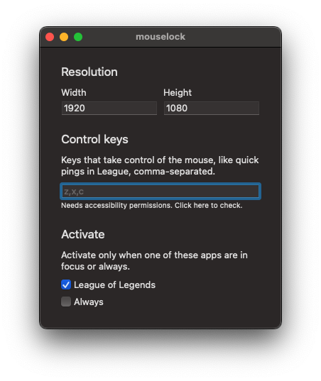

<h1 align="center">
  mouselock (forked to support Europa Universalis IV)
</h1>

  
   
  Lock mouse cursor to a centered area of the screen for MacOS.
   
  

## Why?

In LoL, EU4 (and potentially other games), the cursor is not locked properly in borderless mode. This app and some tricky scripts are trying to fix that.

Also, `Makefile` script sets the bundle identifier for EU4 app, because its missing.

## Requirements

Requires MacOS 11.0 or later.

## Tips

- Get [LinearMouse](https://linearmouse.org) to remove mouse acceleration.
